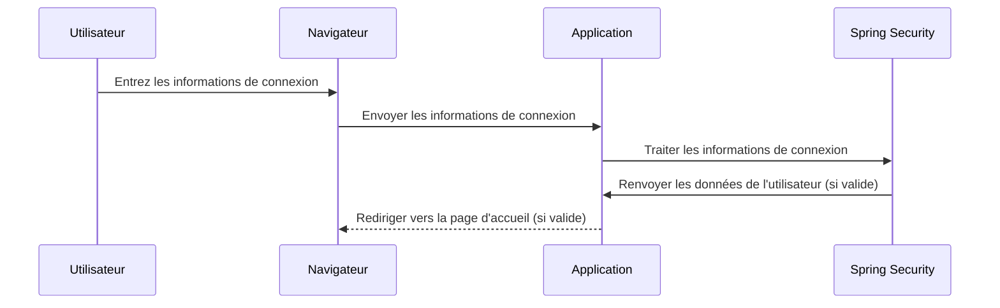

# Authentification Utilisateur avec Spring Security

Ce document explique le processus d'authentification d'un utilisateur dans une application Spring Boot sécurisée à l'aide de Spring Security.

## Diagramme de Séquence


    
## Détails du Processus

Utilisateur entre les informations de connexion : L'utilisateur entre son nom d'utilisateur et son mot de passe dans le formulaire de connexion de l'interface utilisateur.

Envoi des Informations de Connexion : Le navigateur envoie les informations de connexion à l'application via une requête HTTP.

```java

// Extrait de code du formulaire de connexion (LoginForm)
public class LoginForm {
    private String username;
    private String password;
    // Getters et Setters
}
```

Traitement par Spring Security : Spring Security intercepte la requête, extrait les informations de connexion et les traite en utilisant le gestionnaire d'authentification configuré.

```java

// Extrait de code de la configuration Spring Security (SecurityConfig)
@Configuration
@EnableWebSecurity
public class SecurityConfig extends WebSecurityConfigurerAdapter {
    // Configurations de sécurité ici
}
```

Consultation de la Base de Données : Le gestionnaire d'authentification interroge la base de données pour vérifier les informations de connexion. La base de données contient les informations des utilisateurs, y compris les noms d'utilisateur et les mots de passe hashés.

```java

// Extrait de code de l'entité User (User)
@Entity
@Table(name = "users")
public class User {
    // Propriétés de l'utilisateur
}
```

Réponse de Spring Security : Si les informations de connexion sont valides, Spring Security renvoie les données de l'utilisateur à l'application.

```java
// Extrait de code de l'implémentation UserDetails (CustomUserDetails)
public class CustomUserDetails implements UserDetails {
    // Implémentation des méthodes UserDetails ici
}
```

Redirection vers la Page d'Accueil : L'application redirige l'utilisateur vers la page d'accueil ou la page protégée, l'informant ainsi que la connexion est réussie.

```java

// Extrait de code de la redirection après l'authentification (Controller)
@GetMapping("/home")
public String home() {
    // Logique de gestion de la page d'accueil ici
    return "home";
}
```

C'est ainsi que fonctionne le processus d'authentification dans l'application Spring Boot sécurisée avec Spring Security.