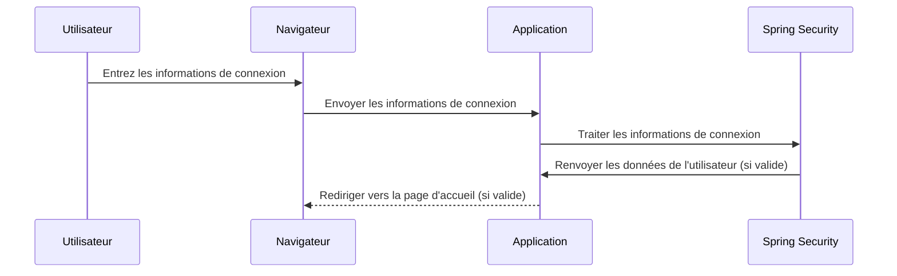

# Authentification Utilisateur avec Spring Security

Ce document explique le processus d'authentification d'un utilisateur dans une application Spring Boot sécurisée à l'aide de Spring Security.


## Docs

- https://howtodoinjava.com/spring-security/login-form-example/

## Diagramme de Séquence


    
## Détails du Processus

Utilisateur entre les informations de connexion : L'utilisateur entre son nom d'utilisateur et son mot de passe dans le formulaire de connexion de l'interface utilisateur.

Envoi des Informations de Connexion : Le navigateur envoie les informations de connexion à l'application via une requête HTTP.

```java

// Extrait de code du formulaire de connexion (LoginForm)
public class LoginForm {
    private String username;
    private String password;
    // Getters et Setters
}
```

Traitement par Spring Security : Spring Security intercepte la requête, extrait les informations de connexion et les traite en utilisant le gestionnaire d'authentification configuré.

```java

// Extrait de code de la configuration Spring Security (SecurityConfig)
@Configuration
@EnableWebSecurity
public class SecurityConfig extends WebSecurityConfigurerAdapter {
    // Configurations de sécurité ici
}
```

Consultation de la Base de Données : Le gestionnaire d'authentification interroge la base de données pour vérifier les informations de connexion. La base de données contient les informations des utilisateurs, y compris les noms d'utilisateur et les mots de passe hashés.

```java

// Extrait de code de l'entité User (User)
@Entity
@Table(name = "users")
public class User {
    // Propriétés de l'utilisateur
}
```

Réponse de Spring Security : Si les informations de connexion sont valides, Spring Security renvoie les données de l'utilisateur à l'application.

```java
// Extrait de code de l'implémentation UserDetails (CustomUserDetails)
public class CustomUserDetails implements UserDetails {
    // Implémentation des méthodes UserDetails ici
}
```

Redirection vers la Page d'Accueil : L'application redirige l'utilisateur vers la page d'accueil ou la page protégée, l'informant ainsi que la connexion est réussie.

```java

// Extrait de code de la redirection après l'authentification (Controller)
@GetMapping("/home")
public String home() {
    // Logique de gestion de la page d'accueil ici
    return "home";
}
```


 Dans ce code, /login est la page de connexion personnalisée que vous avez créée. Lorsque l'authentification réussit, l'utilisateur est redirigé vers /home. En cas d'échec de l'authentification, l'utilisateur est redirigé vers /login?error=true. Après la déconnexion réussie, l'utilisateur est redirigé vers /login?logout=true. En cas de violation de l'autorisation, l'utilisateur est redirigé vers /access-denied.

Avec cette configuration, vous n'avez pas besoin de gérer manuellement les redirections dans votre contrôleur. Spring Security gère cela pour vous en fonction du résultat de l'authentification. Assurez-vous d'avoir une page access-denied.html dans votre dossier des pages pour gérer les erreurs d'autorisation.


User
Ajouter la notion de ROLE
ChatGPT
Pour ajouter la notion de rôles à votre système d'authentification, vous pouvez configurer Spring Security pour gérer les rôles et les autorisations. Voici comment vous pouvez le faire :

Ajouter les rôles à votre modèle User :
Modifiez votre modèle User pour inclure une liste de rôles. Les rôles peuvent être définis comme une collection de chaînes.

java
Copy code
@Entity
@Table(name = "users")
public class User {

    // ... autres propriétés

    @ElementCollection(targetClass = String.class)
    @CollectionTable(name = "user_roles", joinColumns = @JoinColumn(name = "user_id"))
    @Column(name = "role")
    private Set<String> roles = new HashSet<>();

    // Getters et Setters
}
Configurer les rôles dans SecurityConfig :
Modifiez votre classe de configuration SecurityConfig pour inclure les autorisations basées sur les rôles.

java
Copy code
@Configuration
@EnableWebSecurity
public class SecurityConfig extends WebSecurityConfigurerAdapter {

    @Override
    protected void configure(HttpSecurity http) throws Exception {
        http
            .authorizeRequests()
                .antMatchers("/login").permitAll()
                .antMatchers("/admin").hasRole("ADMIN") // Exige le rôle ADMIN pour accéder à /admin
                .anyRequest().authenticated()
                .and()
            .formLogin()
                .loginPage("/login")
                .defaultSuccessUrl("/home")
                .failureUrl("/login?error=true")
                .and()
            .logout()
                .logoutSuccessUrl("/login?logout=true")
                .and()
            .exceptionHandling()
                .accessDeniedPage("/access-denied");
    }

    @Autowired
    public void configureGlobal(AuthenticationManagerBuilder auth) throws Exception {
        auth
            .inMemoryAuthentication()
                .withUser("admin").password(passwordEncoder().encode("adminPass")).roles("ADMIN")
                .and()
                .withUser("user").password(passwordEncoder().encode("userPass")).roles("USER");
    }

    @Bean
    public PasswordEncoder passwordEncoder() {
        return new BCryptPasswordEncoder();
    }
}
Dans cet exemple, l'URL /admin nécessite le rôle ADMIN pour y accéder. Lorsque vous configurez l'authentification en mémoire (configureGlobal), vous attribuez le rôle ADMIN à l'utilisateur "admin".

N'oubliez pas de définir le PasswordEncoder (dans cet exemple, BCryptPasswordEncoder) pour assurer le cryptage des mots de passe.

Dans votre modèle UserDetailsService personnalisé :
Si vous utilisez un service UserDetailsService personnalisé, vous pouvez définir les rôles de l'utilisateur dans la méthode loadUserByUsername.

java
Copy code
@Service
public class CustomUserDetailsService implements UserDetailsService {

    @Autowired
    private UserRepository userRepository;

    @Override
    public UserDetails loadUserByUsername(String username) throws UsernameNotFoundException {
        User user = userRepository.findByUsername(username);
        if (user == null) {
            throw new UsernameNotFoundException("Utilisateur non trouvé avec le nom d'utilisateur: " + username);
        }
        return new CustomUserDetails(user);
    }
}
Assurez-vous de renvoyer une implémentation de UserDetails qui inclut les rôles de l'utilisateur (GrantedAuthority).

Cela met en place la gestion des rôles basée sur les autorisations avec Spring Security dans votre application. N'oubliez pas de personnaliser ces configurations en fonction de vos besoins spécifiques en matière d'autorisations et de rôles.


C'est ainsi que fonctionne le processus d'authentification dans l'application Spring Boot sécurisée avec Spring Security.